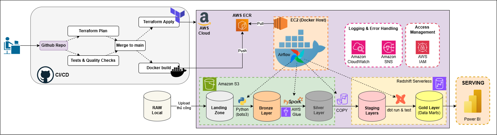
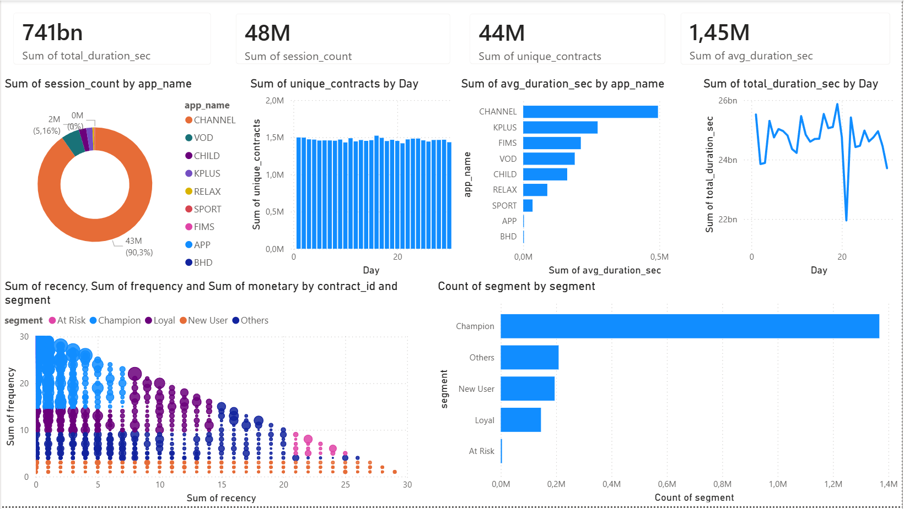
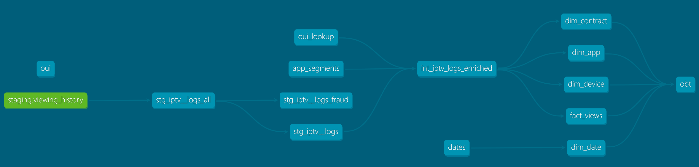
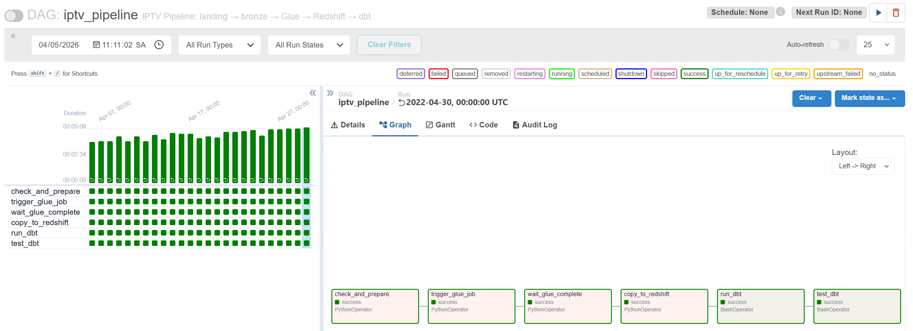
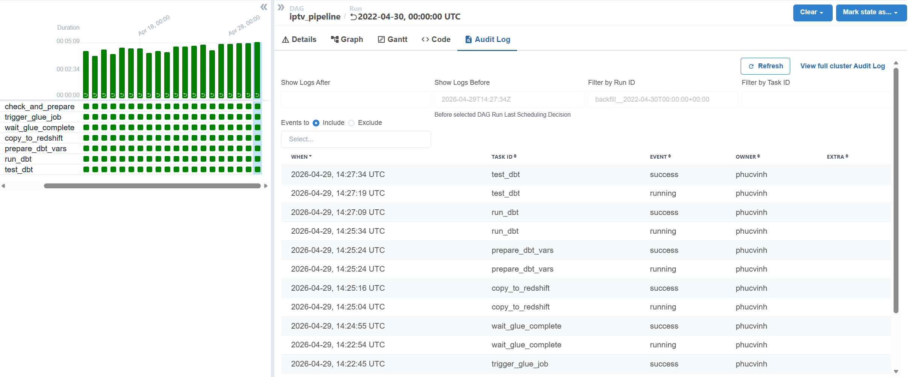
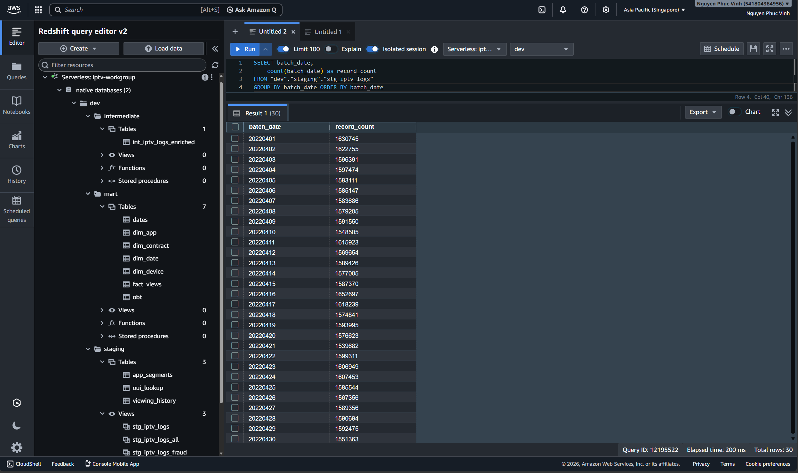

# End-to-End IPTV Analytics: A Hybrid Lake-Warehouse Implementation on AWS
<a name="top"></a>


> ⭐ **If this project helps you, please consider giving it a star on GitHub!** ⭐

## Mục lục

- [Tổng quan](#tổng-quan)
  - [Sơ đồ kiến trúc (Architecture Diagram)](#sơ-đồ-kiến-trúc-architecture-diagram)
  - [Vấn đề đặt ra](#vấn-đề-đặt-ra)
  - [Mục tiêu](#mục-tiêu)
  - [Giá trị mang lại](#giá-trị-mang-lại)
  - [Giai đoạn hiện tại](#giai-đoạn-hiện-tại)
  - [Trực quan hóa dữ liệu (Data Visualization)](#trực-quan-hóa-dữ-liệu-data-visualization)

- [Tài liệu chi tiết (Detailed Documentation)](#tài-liệu-chi-tiết-detailed-documentation)
- [Kiến trúc hệ thống (Architecture)](#kiến-trúc-hệ-thống-architecture)
- [Công nghệ sử dụng (Tech Stack)](#công-nghệ-sử-dụng-tech-stack)
- [Cấu trúc project (Project Structure)](#cấu-trúc-project-project-structure)

- [Lược đồ dữ liệu (Data Schema)](#lược-đồ-dữ-liệu-data-schema)
  - [Dữ liệu thô — Bronze Layer](#dữ-liệu-thô--bronze-layer)
  - [Dữ liệu sạch — Silver Layer](#dữ-liệu-sạch--silver-layer-parquet)
  - [Dữ liệu phân tích — Gold Layer](#dữ-liệu-phân-tích--gold-layer-redshift)

- [Pipeline Airflow — DAG](#pipeline-airflow--dag-iptv_pipeline)

- [Cách chạy (How to run)](#cách-chạy-how-to-run)
  - [Yêu cầu](#yêu-cầu)
  - [Các bước](#các-bước)

- [Kết quả](#kết-quả)
- [Bài học kinh nghiệm (Lessons Learned)](#bài-học-kinh-nghiệm-lessons-learned)
- [Triển khai & Mở rộng (Production & Future Improvements)](#triển-khai--mở-rộng-production--future-improvements)
- [Liên hệ (Contact)](#liên-hệ-contact)


---
## Tổng quan
### Sơ đồ kiến trúc (Architecture Diagram)

### Vấn đề đặt ra

Các nhà cung cấp IPTV thu thập hàng triệu bản ghi log xem truyền hình thô mỗi ngày, nhưng dữ liệu rất hỗn loạn: thiếu các trường thông tin, thời lượng không hợp lệ, các sự kiện bị trùng lặp và nghi ngờ có các hợp đồng gian lận chia sẻ quá nhiều thiết bị. Nếu không có một pipeline đáng tin cậy, đội ngũ nội dung và kinh doanh không thể trả lời các câu hỏi cơ bản như:

- Ứng dụng/kênh nào giữ chân người xem lâu nhất mỗi ngày?
- Có bao nhiêu subscribers duy nhất đang hoạt động?
- Những hợp đồng nào cho thấy hành vi đa thiết bị bất thường (nghi vấn gian lận)?

### Mục tiêu

Xây dựng một data pipeline hoàn toàn tự động trên AWS, áp dụng kiến trúc Medallion (Bronze → Silver → Gold) với Data Lake (S3) và Data Warehouse (Redshift) để nạp dữ liệu IPTV log thô hàng ngày, làm sạch và biến đổi dữ liệu thông qua Medallion architecture (Bronze → Silver → Gold), nạp vào Redshift và cung cấp các bảng sẵn sàng cho phân tích thông qua dbt, tất cả được điều phối bởi Apache Airflow.

### Giá trị mang lại
Pipeline này giúp:
- Theo dõi mức độ engagement của người dùng theo từng kênh
- Phát hiện hành vi chia sẻ tài khoản bất thường
- Hỗ trợ đội business tối ưu nội dung và chiến lược giữ chân người dùng

### Giai đoạn hiện tại
> **Repository này mô tả giai đoạn chạy pipeline trong môi trường Docker cục bộ.**
> Toàn bộ hạ tầng AWS (EC2, Glue, Redshift Serverless) được định nghĩa qua Terraform và đã sẵn sàng để triển khai. Logic của pipeline đã hoạt động đầy đủ và được kiểm thử end-to-end trong Docker.

### Trực quan hóa dữ liệu (Data Visualization)

---

## Tài liệu chi tiết (Detailed Documentation)

Dự án đi kèm với bộ tài liệu phân tích kỹ thuật chuyên sâu. Vui lòng tham khảo các liên kết dưới đây để hiểu rõ hơn về các quyết định thiết kế và chi tiết nghiệp vụ:

| Loại tài liệu | Bài viết | Mô tả |
| :--- | :--- | :--- |
| **Kiến trúc (Architecture)** |  [1. Kiến trúc hệ thống (Data Stack)](docs/architecture/1.data-stack.md) | Phân tích chi tiết lý do lựa chọn công nghệ (AWS S3, Glue, Redshift, dbt). |
| |  [2. Luồng dữ liệu (Data Flow)](docs/architecture/2.data-flow.md) | Giải thích chi tiết vòng đời dữ liệu từ lúc tạo ra đến khi lên Dashboard. |
| **Dữ liệu (Data)** |  [1. Phân tích dữ liệu (Data Profiling)](docs/data/1.profiling.md) | Khảo sát dữ liệu gốc, phát hiện các bất thường (thời lượng âm, null MAC). |
| |  [2. Từ điển dữ liệu (Data Dictionary)](docs/data/2.dictionary.md) | Định nghĩa schema cho tất cả các bảng ở các lớp Bronze, Silver, và Gold. |
| |  [3. Mô hình hóa (Data Modeling)](docs/data/3.modeling.md) | Logic áp dụng dbt (3-model structure) và phân tách dữ liệu gian lận. |

---

## Kiến trúc hệ thống (Architecture)
Pipeline xử lý theo batch hàng ngày:
S3 (Landing) → Glue (ETL) → S3 (Silver) → Redshift → dbt (Gold)
"Đây là kiến trúc Lake + Warehouse: dữ liệu thô và đã làm sạch được lưu trên Data Lake (S3), sau đó được nạp vào Redshift để phục vụ phân tích. Cấu trúc Medallion (Bronze/Silver/Gold) được áp dụng xuyên suốt."
```
Raw JSON Logs 
        │
        ▼
  ┌─────────────┐
  │  Landing/   │  ← Daily JSON file dropped here (S3)
  └──────┬──────┘
         │  Airflow: check_and_prepare
         ▼
  ┌─────────────┐
  │   Bronze/   │  ← Dữ liệu thô sẽ chuyển vào đây và được phân vùng theo date
  └──────┬──────┘
         │  AWS Glue (PySpark)
         ▼
  ┌─────────────┐
  │   Silver/   │  ← Làm sạch, chuẩn hóa, đánh nhãn gian lận
  └──────┬──────┘
         │  Redshift COPY
         ▼
  ┌──────────────────────┐
  │  staging.viewing_    │  ← Bảng staging thô trong Redshift
  │       history        │
  └──────┬───────────────┘
         │  dbt run
         ▼
  ┌──────────────────────┐
  │  mart.fct_daily_     │  ← Bảng Gold sẵn sàng phân tích
  │       views          │
  └──────────────────────┘
```

**Điều phối pipeline:** Apache Airflow lập lịch và giám sát mọi bước trên. \
**Quản lý hạ tầng:** Terraform quản lý tất cả tài nguyên AWS (S3, IAM roles, Glue job, Redshift Serverless).

---

## Công nghệ sử dụng (Tech Stack)

| Lớp           | Công nghệ                          | Mục đích                                  |
|------------------|--------------------------------------|------------------------------------------|
| Orchestration    | Apache Airflow 2.x (Docker)          | Lập lịch DAG, backfill, giám sát    |
| Storage          | AWS S3                               | Data Lake (Bronze/Silver layers)     |
| Warehouse        | AWS Redshift Serverless              | Gold layer (Analytical queries)      |
| Processing       | AWS Glue + PySpark                   | Làm sạch dữ liệu, phát hiện gian lận           |
| Transformation   | dbt-core 1.7 + dbt-redshift          | Mô hình hóa SQL, kiểm thử, lineage           |
| Warehouse        | AWS Redshift Serverless              | Lớp truy vấn phân tích                 |
| Containerization | Docker + Docker Compose              | Phát triển và kiểm thử cục bộ            |
| IaC              | Terraform                            | Hạ tầng AWS dưới dạng mã nguồn             |
| Language         | Python 3.12                          | Airflow DAGs, mã nạp dữ liệu          |

**Lý do lựa chọn stack (Design Decisions)**
- AWS Glue & Redshift Serverless: Mô hình NoOps, tự động mở rộng và chỉ trả tiền khi sử dụng.
    - Note: Có thể thay Redshift bằng Athena để tối ưu chi phí (Pay-per-query), chấp nhận đánh đổi về độ trễ (latency).
- dbt: Áp dụng tư duy kỹ thuật phần mềm vào SQL (Lineage, Testing, Version Control).
- Apache Airflow: Điều phối các phụ thuộc (Dependencies) phức tạp, hỗ trợ Backfill và Retry mạnh mẽ.
- Terraform: Đảm bảo tính nhất quán của hạ tầng, dễ dàng tái bản môi trường qua code.
---

## Cấu trúc project (Project Structure)

```text
IPTV_DE/
├── airflow/
│   ├── dags/
│   │   └── iptv_daily_pipeline.py    # Main Airflow DAG
│   ├── logs/                         # Airflow task logs
│   └── plugins/                      # Custom Airflow plugins 
│
├── docs/                             # Detailed technical documentation
│   ├── architecture/
│   └── data/
│
├── glue/
│   └── bronze_to_silver.py           # PySpark script for Glue ETL & Fraud detection
│
├── ingestion/
│   └── upload_to_s3.py               # Script to upload raw JSON to S3 landing/
│
├── dataset/                          # Sample data files
│
├── iptv_dbt/
│   ├── models/
│   │   ├── lv1_staging/
│   │   │   ├── stg_iptv_logs_all.sql    # Base model & cast data
│   │   │   ├── stg_iptv_logs.sql        # Staging view (valid records)
│   │   │   └── stg_iptv_logs_fraud.sql  # Fraud tracking audit
│   │   └── lv3_mart/
│   │       └── fct_daily_views.sql       # Gold fact table (daily aggregation)
│   ├── tests/                            # dbt data quality tests
│   ├── dbt_project.yml
│   └── profiles.yml                      # Redshift connection config
│
├── terraform/
│   ├── main.tf                       # S3, IAM, Glue job, Redshift
│   ├── variables.tf
│   └── outputs.tf
│
├── src/
│   └── dataprofiling.py              # Exploratory data profiling script
│
├── docker-compose.yml                # Airflow local environment
├── requirements.txt                  # Python dependencies
└── .env.example                      # Environment variable template
```

---

## Lược đồ dữ liệu (Data Schema)

### Dữ liệu thô — Landing Layer (S3)

Dữ liệu được upload lên S3 thông qua script `upload_to_s3.py`. Mỗi file tương ứng với một ngày và được đặt tên theo định dạng `YYYYMMDD.json`.

**Cấu trúc file Landing (Raw Elasticsearch Export):**

Mỗi dòng trong file là một JSON object hoàn chỉnh chứa metadata của Elasticsearch và payload nghiệp vụ nằm trong `_source`.

| Field               | Type   | Mô tả                                          |
|---------------------|--------|------------------------------------------------|
| `_index`            | string | Tên index trong Elasticsearch                  |
| `_type`             | string | Loại document                                  |
| `_id`               | string | ID sự kiện gốc                                 |
| `_score`            | float  | Điểm liên quan (không sử dụng)                 |
| `_source`           | object | **Object chứa dữ liệu nghiệp vụ thực tế**      |
| `_source.Contract`  | string | ID thuê bao (khách hàng)                       |
| `_source.Mac`       | string | Địa chỉ MAC thiết bị (có thể chứa dấu phẩy)    |
| `_source.TotalDuration` | long | Thời gian xem (giây, dữ liệu thô chưa validate) |
| `_source.AppName`   | string | Tên ứng dụng/kênh được xem                     |

**Dữ liệu mẫu**
```json
{"_index":"history","_type":"channel","_id":"AX_mod8fa1FFivsGq-wr","_score":0,"_source":{"Contract":"BDH013139","Mac":"E4AB8927BC01","TotalDuration":72,"AppName":"CHANNEL"}}
{"_index":"history","_type":"kplus","_id":"AYAkbMF0a1FFivsG1TPM","_score":0,"_source":{"Contract":"SGH597377","Mac":"0C96E6E84A15","AppName":"KPLUS","TotalDuration":6274}}
{"_index":"history","_type":"child","_id":"AX_w4kTra1FFivsGyXQe","_score":0,"_source":{"Contract":"BIFD35806","Mac":"10394E17B15C","AppName":"CHILD","TotalDuration":309}}
{"_index":"history","_type":"vod","_id":"AX_ru-5ua1FFivsGrqe2","_score":0,"_source":{"Contract":"DTFD19291","Mac":"B84DEE76AEFC","TotalDuration":46486,"AppName":"VOD"}}
```

---

### Dữ liệu đã chuẩn hóa — Bronze Layer (S3)

Trong Airflow DAG, task `check_and_prepare` đọc file từ Landing, thực hiện **làm phẳng (flatten)** cấu trúc JSON lồng nhau và tạo ra dữ liệu dạng phẳng (flat JSON) lưu vào Bronze layer. `batch_date` được trích xuất từ tên file (`YYYYMMDD.json`) và được gán vào mỗi bản ghi như một trường để phân vùng.

**Cấu trúc Bronze (Input cho AWS Glue):**

| Field            | Type   | Mô tả                                                       |
|------------------|--------|-------------------------------------------------------------|
| `event_id`       | string | Trích xuất từ `_id`                                         |
| `contract_id`    | string | Trích xuất từ `_source.Contract`                            |
| `device_mac`     | string | Trích xuất từ `_source.Mac` (chưa chuẩn hóa format)         |
| `total_duration` | long   | Trích xuất từ `_source.TotalDuration`                       |
| `app_name`       | string | Trích xuất từ `_source.AppName`                             |
| `batch_date`     | string | Ngày xử lý, lấy từ tên file (định dạng `YYYYMMDD`)          |

**Lưu ý:**
- Dữ liệu ở Bronze **chưa được làm sạch** (vẫn có thể chứa giá trị null, duration âm hoặc vượt ngưỡng, MAC chứa dấu phẩy...).
- Việc kiểm tra chất lượng và chuẩn hóa nghiệp vụ sẽ được thực hiện trong **AWS Glue job** khi chuyển từ Bronze → Silver.

### Dữ liệu sạch — Silver Layer (Parquet)

Output từ job AWS Glue, được lưu trên S3 và partition theo year/month/day.

| Field                    | Type    | Mô tả                                                      |
| ------------------------ | ------- | ---------------------------------------------------------- |
| `event_id`               | string  | ID sự kiện sau deduplicate                                 |
| `contract_id`            | string  | ID khách hàng (gồm cả Null/Dị dạng để tracking)            |
| `device_mac`             | string  | MAC đã chuẩn hóa (nếu format hợp lệ)                       |
| `app_name`               | string  | Tên kênh/app                                               |
| `total_duration_seconds` | integer | Thời gian xem (gồm cả thời gian âm/quá hạn)                |
| `batch_date`             | string  | Ngày xử lý partition (YYYYMMDD)                            |
| `event_date`             | date    | Ngày sự kiện thực tế phát sinh                             |
| `is_fraudulent`          | boolean | Cờ đánh dấu dòng dữ liệu lỗi / vi phạm                     |
| `fraud_reasons`          | string  | Mảng chứa các cảnh báo lỗi (VD: "Missing device_mac")      |
| `device_flag`            | string  | Nhóm hành vi chia sẻ thiết bị (normal / fraud_suspect)     |


**Các bước xử lý trong Glue job:**
- Đổi tên và ép kiểu các trường theo schema chuẩn, sinh ra `event_date`.
- Ghi nhận lỗi các bản ghi null/empty ở contract_id, device_mac vào `fraud_reasons`.
- Ghi nhận cảnh báo các mốc thời gian dị thường (âm, quá 24h).
- Ghi nhận cảnh báo app test nội bộ (AppName = 'BHD').
- Chuẩn hóa MAC address. Track MAC address sai định dạng vào `fraud_reasons`.
- Loại bỏ hoàn toàn bản ghi trùng lặp (Dedup) dựa trên event_id.
- Phát hiện gian lận: cấp nhãn vào `device_flag` và ghi nhận mảng "Too many devices" nếu hợp đồng vượt trần đăng nhập. Bật cờ `is_fraudulent = True` nếu bản ghi có bất kì lỗi nào để báo cáo Audit downstream. Toàn bộ dữ liệu được nạp 100% xuống Silver / Redshift.

### Dữ liệu phân tích — Gold Layer (Redshift)
**Grain:** 1 record / (batch_date, app_name)

**`lv1_staging.stg_iptv_logs_all`** — Đầu não Staging view (dbt)

| Field                    | Type                   | Mô tả |
|--------------------------|------------------------|------|
| `event_id`               | varchar(30)            | ID sự kiện duy nhất |
| `contract_id`            | varchar(30)           | ID thuê bao |
| `total_duration_seconds` | integer                | Thời gian xem (giây) |
| `total_duration_minutes` | real                   | Thời gian xem (phút) |
| `app_name`               | varchar(20)            | Tên kênh/app |
| `batch_date`             | varchar(20)            | Ngày xử lý partition (YYYYMMDD) |
| `view_year` / `month`    | integer                | Cụm tham số thời gian phái sinh |
| `is_fraudulent`          | boolean                | Biến kiểm soát rẽ nhánh dữ liệu sạch vs rác |
| `fraud_reasons`          | varchar                | Tổ hợp mảng tag audit nguyên nhân bị cắm cờ |

Dữ liệu base sẽ được rẽ thành nguồn **Fact report sạch** (`stg_iptv_logs`) với điều kiện lọc rác `is_fraudulent = FALSE`, và báo cáo **Security Audit bẩn** (`stg_iptv__logs_fraud`) đối nghịch.

**`mart.fct_daily_views`** — Daily fact table (dbt)

| Field                     | Mô tả                                        |
| ------------------------- | -------------------------------------------- |
| `pk`                      | Khóa surrogate từ (`batch_date`, `app_name`) |
| `batch_date`              | Ngày xử lý (YYYYMMDD)                        |
| `app_name`                | Tên kênh/app                                 |
| `total_sessions`          | Tổng số phiên xem                            |
| `unique_contracts`        | Số lượng thuê bao duy nhất                   |
| `unique_devices`          | Số lượng thiết bị duy nhất                   |
| `total_seconds`           | Tổng thời gian xem (giây)                    |
| `total_hours`             | Tổng thời gian xem (giờ)                     |
| `avg_minutes_per_session` | Thời gian xem trung bình mỗi phiên (phút)    |

**Trực quan hóa mô hình qua dbt Lineage**


---

## Pipeline Airflow — DAG: iptv_pipeline
- Các task được cấu hình retry và timeout để đảm bảo pipeline ổn định




| Task                 | Mô tả                                                                                                                                      |
| -------------------- | ------------------------------------------------------------------------------------------------------------------------------------------ |
| `check_and_prepare`  | Đọc `ds_nodash` từ context của Airflow. Kiểm tra dữ liệu ở Landing → chuyển sang Bronze, hoặc xác nhận Bronze đã tồn tại để rerun/backfill |
| `trigger_glue_job`   | Khởi chạy job AWS Glue (PySpark) với input/output trên S3 và tham số fraud threshold                                                       |
| `wait_glue_complete` | Kiểm tra trạng thái job Glue mỗi 30s cho đến khi hoàn thành hoặc thất bại (tối đa 1 giờ)                                                   |
| `copy_to_redshift`   | Xóa dữ liệu cũ theo `batch_date` trong staging, sau đó COPY dữ liệu từ Silver (Parquet)                                                    |
| `run_dbt`            | Chạy các model dbt (chia nhanh dữ liệu thông qua `stg_iptv_logs`, aggregate tại `fct_daily_views`)                                         |
| `test_dbt`           | Chạy test dbt để kiểm tra chất lượng dữ liệu                                                                                               |


---
## Cách chạy (How to run)

### Yêu cầu

- Docker Desktop installed and running
- AWS account with S3, Glue, Redshift Serverless configured (or Terraform deployed)
- Python 3.12+

### Các bước

**1. Clone the repository**
```bash
git clone https://github.com/your-username/IPTV_DE.git
cd IPTV_DE
```

**2. Tạo file .env**
```bash
cp .env.example .env
```

Thêm vào file `.env` với các biến của bạn
```env
S3_BUCKET=your-bucket-name
REDSHIFT_WORKGROUP=your-workgroup
REDSHIFT_DATABASE=your-database
REDSHIFT_IAM_ROLE=arn:aws:iam::123456789:role/your-role
AWS_DEFAULT_REGION=ap-southeast-1
AWS_ACCESS_KEY_ID=your-access-key
AWS_SECRET_ACCESS_KEY=your-secret-key
DBT_PROJECT_DIR=/opt/airflow/iptv_dbt
DBT_PROFILES_DIR=/opt/airflow/iptv_dbt
DBT_BIN=/home/airflow/.local/bin/dbt
```

**3. Khởi chạy airflow**
```bash
docker-compose up -d
```
Đợi khoảng 30-60 giây rồi kiểm tra các container đã healthy chưa:
```bash
docker ps
```
Đảm bảo thấy `airflow-scheduler`, `airflow-webserver` đều ở trạng thái `healthy`.

**4. Truy cập Airflow UI**

Mở `http://localhost:8080` — Nhập: `airflow / airflow`

**5. Upload raw data lên S3 landing**
```bash
python ingestion/upload_to_s3.py --date 2022-04-01
```

**6. Khởi chạy pipeline (3 lựa chọn)**

- Option A: Kích hoạt qua API (Production): Dành cho dữ liệu hằng ngày.
Hệ thống upstream upload file lên S3 landing/ rồi trigger DAG qua Airflow API.

- Option B: Chạy bù dữ liệu lịch sử (Backfill): Dành cho nạp dữ liệu quá khứ.
```bash
# Cần Pause DAG trên UI trước khi thực hiện lệnh CLI:
# Trường hợp 1 — Chạy lần đầu
docker exec -it airflow-airflow-scheduler-1 airflow dags backfill -s 2022-04-01 -e 2022-04-04 iptv_pipeline

# Trường hợp 2 — Reset và chạy lại
docker exec -it airflow-airflow-scheduler-1 airflow dags backfill -s 2022-04-01 -e 2022-04-02 --reset-dagruns iptv_pipeline
# Trường hợp 3 — Reset và chạy tiếp
docker exec -it airflow-airflow-scheduler-1 airflow dags backfill -s 2022-04-01 -e 2022-04-02 --reset-dagruns iptv_pipeline --continue-dag-runs
```

- Option C: Kích hoạt thủ công (Manual Trigger): Dành cho kiểm thử (Testing). Trên UI chọn Trigger DAG w/ config và nhập logical date.
Hoặc dùng CLI: airflow dags trigger iptv_pipeline --logical-date 2022-04-04T00:00:00+00:00


---

## Kết quả

Truy vấn sau khi hoàn thành pipeline:



---

## Bài học kinh nghiệm (Lessons Learned)

**1. Airflow XCom & thiết kế luồng xử lý đơn (single-path)**
- Ban đầu DAG sử dụng BranchPythonOperator với hai nhánh manual và auto, dẫn đến lỗi XCom “silent” khi thiếu task_ids trong xcom_pull. Sau đó refactor về một task duy nhất check_and_prepare sử dụng ds_nodash — giúp đơn giản hóa logic, giảm lỗi và dễ debug hơn. 

**2.Catchup và Backfill qua CLI**
- Việc đặt catchup=True mà không có end_date có thể tạo ra hàng nghìn DAG run không mong muốn từ start_date. Best practice là để catchup=False cho scheduler, và sử dụng CLI airflow dags backfill với khoảng thời gian cụ thể khi cần chạy lại dữ liệu lịch sử. Luôn pause DAG trước khi backfill để tránh xung đột.

**3. dbt không nằm trong PATH của BashOperator**
- BashOperator chạy trong môi trường shell tối giản, không load virtualenv nên không tìm thấy dbt dù đã cài đặt. Cách xử lý là sử dụng đường dẫn tuyệt đối đến binary của dbt (ví dụ: /home/airflow/.local/bin/dbt) hoặc truyền qua biến môi trường.

**4. Vấn đề concurrency và lock trong Redshift**
- Chạy nhiều DAG run song song cùng thực hiện lệnh COPY vào một bảng staging gây ra lock contention. Giải pháp là đặt max_active_runs=1 để đảm bảo các batch chạy tuần tự, tránh timeout trong Redshift.

**5. Trạng thái container Docker không được lưu trữ**
- Các package cài trực tiếp trong container sẽ bị mất sau khi restart. Vì vậy, cần khai báo toàn bộ dependencies trong requirements.txt để đảm bảo mỗi lần build lại đều reproducible.

---

## Triển khai & Mở rộng (Production & Future Improvements)

- [ ] Triển khai toàn bộ hạ tầng lên AWS (EC2, S3, Glue, Redshift) thông qua terraform apply
- [ ] Tích hợp Great Expectations để kiểm tra chất lượng dữ liệu đầu vào tại Bronze layer
- [ ] Xây dựng dashboard giám sát trên AWS QuickSight hoặc Metabase
- [ ] Thiết lập hệ thống cảnh báo (alerting) qua SNS khi pipeline gặp lỗi
- [ ] Mở rộng logic phát hiện gian lận bằng mô hình Machine Learning (anomaly detection)

---

## Liên hệ (Contact)

**Nguyen Phuc Vinh**
- Email: phucvinh235371@gmail.com
- LinkedIn: [linkedin.com/in/phucvinh235371](https://www.linkedin.com/in/phucvinh235371)

[Quay lại đầu trang](#top)
