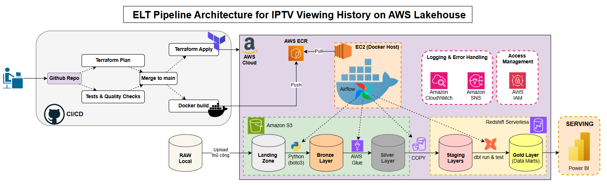

# Architecture Decision Records — IPTV Viewing History Data Stack

Tài liệu này ghi lại các Architecture Decision Records (ADR) cho dự án **IPTV Viewing History — End-to-End Analytics Pipeline**. Mỗi ADR trình bày bối cảnh, quyết định, phân tích các phương án thay thế, và hệ quả đi kèm.

---

## Mục lục

| ADR | Chủ đề | Quyết định | Trạng thái |
|-----|--------|-----------|-----------|
| [ADR-001](#adr-001-orchestration) | Orchestration | Apache Airflow (Docker) | Đã chấp thuận |
| [ADR-002](#adr-002-ingestion--object-storage) | Ingestion & Object Storage | AWS S3 (Medallion) | Đã chấp thuận |
| [ADR-003](#adr-003-data-processing) | Data Processing | AWS Glue + PySpark | Đã chấp thuận |
| [ADR-004](#adr-004-data-warehouse) | Data Warehouse | AWS Redshift Serverless | Đã chấp thuận |
| [ADR-005](#adr-005-transformation-layer) | Transformation Layer | dbt-core + dbt-redshift | Đã chấp thuận |
| [ADR-006](#adr-006-infrastructure-as-code) | Infrastructure as Code | Terraform | Kế hoạch triển khai |

---
## Diagram


## ADR-001: Orchestration

**Trạng thái:** Đã chấp thuận  
**Ngày quyết định:** 2026-04-12  
**Người quyết định:** Project owner

### Bối cảnh

Data pipeline chạy theo lịch trình hàng ngày (daily batch) với chuỗi phụ thuộc nghiêm ngặt:

```text
Upload JSON → S3 Landing → Glue ETL Job → S3 Silver (parquet) → Redshift COPY → dbt run
```

Hệ thống cần một công cụ Orchestration đáp ứng các tiêu chí: (1) Lên lịch chạy tự động, (2) Giám sát trạng thái từng bước, (3) Tự động retry khi xảy ra lỗi, và (4) Ghi nhận log tập trung dễ dàng tra cứu.

### Quyết định

Sử dụng **Apache Airflow** chạy cục bộ thông qua Docker (`docker-compose`).

### Phân tích các phương án thay thế

| Phương án | Lý do loại bỏ |
|-----------|---------------|
| **Cron Job (Linux/macOS)** | Không cung cấp giao diện trực quan hóa DAG, không hỗ trợ tính năng retry tự động, thiếu log tập trung. Rất khó debug khi data pipeline ngày càng phức tạp. |
| **AWS Step Functions** | Rủi ro chi phí khi tính phí theo số lượng transition (~$0.025/1000 transitions). Cấu hình sử dụng JSON/YAML quá chi tiết (verbose), thiếu khả năng tái sử dụng logic. Không thực sự cần thiết trong môi trường phát triển cục bộ. |
| **Prefect / Dagster** | Hệ sinh thái cộng đồng chưa phổ biến như Airflow. Prefect Cloud có giới hạn tài nguyên ở gói miễn phí. |

### Hệ quả

**Lợi ích**
- Giao diện DAG trực quan: Có thể theo dõi trạng thái từng task và re-run từ điểm thất bại.
- Tích hợp sẵn với các dịch vụ AWS thông qua thư viện `apache-airflow-providers-amazon` (S3Hook, GlueJobOperator, RedshiftSQLOperator).
- Chạy cục bộ trên Docker giúp tận dụng tối đa tài nguyên phần cứng (multi-core, 32 GB RAM); đảm bảo chi phí bằng không (**zero cloud cost**) trong giai đoạn development.
- DAG được viết bằng ngôn ngữ Python thuần túy, dễ dàng thực hiện version control cùng mã nguồn hệ thống.

**Đánh đổi**
- Yêu cầu cấu hình ban đầu phức tạp (`docker-compose` bao gồm Postgres metadata DB, Redis broker, Webserver, Scheduler, Worker).
- Quy trình phát triển DAG phải tuân theo quy tắc idempotency vững chắc và không có tác động phụ tại thời điểm parse time.
- Không phù hợp nếu kiến trúc cần chạy đa môi trường (multi-tenant) hoặc xử lý luồng dữ liệu thời gian thực (real-time streaming).

---

## ADR-002: Ingestion & Object Storage

**Trạng thái:** Đã chấp thuận  
**Ngày quyết định:** 2026-04-12

### Bối cảnh

Dữ liệu nguồn là các tệp JSON thô (raw) sinh ra từ hệ thống IPTV, cần được phân lớp và lưu trữ vào các vùng xử lý khác nhau trước khi nạp vào Data Warehouse. Lớp lưu trữ Object Storage cần có khả năng chứa cấu trúc thông tin định dạng đa dạng (JSON, parquet), tối ưu chi phí thấp, và hỗ trợ liên kết chặt chẽ với các dịch vụ AWS.

### Quyết định

Sử dụng **AWS S3** làm trung tâm Data Lake theo định hướng kiến trúc **Medallion (3 phân lớp)**:

| Phân lớp | S3 Prefix | Mô tả dữ liệu | Định dạng |
|----------|-----------|---------------|-----------|
| **Landing** | `s3://bucket/landing/` | JSON raw nguyên gốc do cơ sở xử lý `upload_to_s3.py` đẩy lên — dữ liệu chưa trải qua giai đoạn thiết lập partition và validate tên file. | `.json` |
| **Bronze** | `s3://bucket/bronze/` | JSON đã vượt qua quy tắc đặt tên dạng `YYYYMMDD_*.json`, đã được cấu hình partition theo thông số `batch_date`. | `.json` |
| **Silver** | `s3://bucket/silver/` | Tập dữ liệu đã qua công đoạn chuẩn hóa, khử trùng lặp (deduplication) và làm sạch — kết quả truy xuất của quá trình phân tích Glue job. | `.parquet` |

> **Tại sao cần thiết kế cả hai lớp Landing và Bronze song hành?** Landing được tạo dựng làm không gian thụ đắc thông tin nguyên thể — chấp nhận ngay cả thông tin thiếu định dạng nhằm mục đích lưu nguyên bản. Lớp Bronze sẽ làm checkpoint đầu tiên quản lý tệp tin sạch với cấu trúc tên tương thích, quản trị cấu trúc khoang chứa theo partition và cấp dữ liệu trực tiếp phục vụ bộ Glue chạy tiến trình. Tại thời điểm nếu data Silver phát hiện ra lỗi bất thường và đòi hỏi khả năng tiếp tục tiến trình tái xử lý (reprocess), tính năng chạy của hệ cơ kết Glue sẽ thao tác gọi thông tin nguồn từ lớp Bronze thay vì tạo truy cứu từ phân vùng Landing (bảo toàn nguyên mẫu thông tin dành cho hoạt động đối chứng - audit).

### Phân tích các phương án thay thế

| Phương án | Lý do loại bỏ |
|-----------|---------------|
| **Local filesystem** | Không đảm bảo tiêu chí hỗ trợ hạ tầng lưu trữ phân tán, kém tích hợp khi trỏ kết hợp Glue hay cấu lệnh Redshift COPY. |
| **AWS EFS / EBS** | Tạo gánh nặng vận hành khi phát sinh kinh phí lớn. Không phải bản lưu nguyên gốc dùng cho native input của Glue. |
| **Kiến trúc giới hạn 2 tầng (Raw + Processed)** | Bị thiếu khuyết luồng quản trị checkpoint (nhập trạm chuẩn kiểm định). |

### Hệ quả

**Lợi ích**
- Tiết kiệm hiệu quả chi phí duy trì trên S3 (~$0.023/GB/tháng dành cho mảng S3 Standard).
- Native input tối ưu cho AWS Glue (đọc trực tiếp S3), và đáp ứng vị trí native target cho `COPY` command từ Redshift.
- Việc thực hiện khóa partition theo `batch_date` cho phép động cơ AWS Glue hay cấu quản truy vấn Athena thiết định hoạt động lọc khóa dữ liệu chuẩn (predicate pushdown), tránh quét tra tệp hao phí tài nguyên toàn cụm (full-scan).
- Dễ dàng khởi chạy xử lý lại dữ liệu (reprocess): chỉ cần xóa Silver partition và chạy lại phiên của Glue job.

**Đánh đổi**
- Quản lý từ S3 thiếu tính hỗ trợ ACID transaction — lưu ý thao tác không dứt trọn cấu thao tác partial writes nguy cơ tồn dư file rác ở cấu trúc silver khi Glue job fail giữa chừng.
- Tước đi query capability hiển nhiên từ silver data (phải thông qua các ứng dụng hạ cấp tiếp trung như Athena hay Redshift Spectrum).

---

## ADR-003: Data Processing

**Trạng thái:** Đã chấp thuận  
**Ngày quyết định:** 2026-04-12

### Bối cảnh

Dữ liệu thô từ lớp S3 Landing cần trải qua một chuỗi các thao tác data transformation phức tạp trước khi được load vào Data Warehouse (Redshift):

1. **Schema normalization** — Parse và ấn định thuộc tính schema cố định từ loại file JSON thô.
2. **Filter invalid records** — Thiết lọc chặn bản ghi không tương thích (ví dụ `duration <= 0` hoặc phần thông tin lố chuẩn tính theo giây là `duration > 86400`).
3. **Remove test traffic** — Khử thông tin thử nội kiểm phát sinh từ app `BHD`.
4. **Normalize MAC address** — Quy trình chuyển đổi form chuẩn `XX:XX:XX:XX:XX:XX` thành định dạng ký tự hoa (uppercase).
5. **Deduplication** — Lược giảm các bản ghi đôi hoặc trùng chéo qua truy vết mảng định danh sự kiện (`event_id`).
6. **Fraud detection** — Cảnh báo kiểm định cờ đỏ (flag) phát sinh theo ngày gắn với `contract_id` vượt mức trần lưu ngưỡng cấu địa chỉ distinct MAC theo kỳ ngày chu trình daily.

### Quyết định

Chạy tiến trình data processing dựa trên **AWS Glue (Serverless)** xử lí sức mạnh từ ngôn chuyên ngành phân tán dữ liệu **PySpark**.

### Phân tích các phương án thay thế

| Phương án | Lý do loại bỏ |
|-----------|---------------|
| **AWS Lambda** | Giới hạn thực tiễn cấu thành ở mức 15 phút execution time, tối đa 10 GB memory. Hoàn toàn thất thoát thuộc tính phân hỗ chức phục hoạt PySpark dùng xử lý distributed processing trên super dataset. |
| **AWS EMR (self-managed cluster)** | Hao phí cao ở ngân lực vận quản provision, scale, hay cấu tính kết terminate. Đánh đổ hiệu năng tính định ngân lượng chi chuẩn vào batch job phát sinh cho dự án chuẩn project cá nhân cá hữu. |
| **Spark on EC2 (self-managed)** | Kéo vãn thêm rào rườm quản rà Spark, JVM dependencies, cùng cấu kĩ chống rớt node. Dư thãi quá định mức vận hành overhead chạy batch dứt quãng 1 lần/ngày. |
| **dbt Python models** | Thao tiến phân vận qua module dbt mô models Python đặt trong Data Warehouse bản tính gốc dựa phân qua môi trường AWS Glue/Spark — đưa thêmabstraction không cần thiết. Thêm vào các cấu lập thiết thanh lọc qua phức hình cũng thuận hợp cho luồng phân tác PySpark thuần so với module dbt Python xử lý. |
| **Pandas (trên Lambda hoặc EC2)** | Thao tác single-node phá hỏng công cuộc áp đặt chu vi giãn khối giãn tính năng khả năng lưu scale. Thiết vận mô Pandas thất bại triệt hạ ở deduplication thuộc distributed form với window function phân thiết xử dataset lớn. |

### Hệ quả

**Lợi ích**
- Kiến trúc **serverless** — gánh bỏ trách nhiệm thiết kế cluster. Chiết thu quản phí khi định DPU-hour khi phiên run. Tối ưu cực biên cho mức batch job ngắt quãng.
- Cấu khối của PySpark DataFrame API tung hàng loạt hàm phân chức như `Window`, danh tổng kết cấu bảng như `groupBy` kèm tính `dropDuplicates` — đáp ứng vô định hỗ thiết đầy uy quản pipeline trên một vòng job duy nhất.
- Hệ tương quy native S3: Đọc tệp cấu parquet/JSON trên AWS S3 môi gốc, xuất lại parquet vào S3, không tốn thất phát công lưu chuyển thông ra nền tảng ngoại tuyến.
- Phân luồng metadata thành kho qua trích lưu Glue Catalog thành dạng thiết đặt quy quản thu gọn (schema registry).

**Đánh đổi**
- Áp mức chạy cold start đánh chậm mất tầm trễ từ 2 đến 3 phút chôn trễ khi bật cấu chu vòng vòng bắt đầu làm chạy engine. Dễ dàng thỏa bộ máy batch cấu ngày chứ trượt cho luống real-time phân cấu mảng.
- Yếu kĩ năng nội debugging thiết local, buộc dọn mác AWS cấu module library docker chuẩn thông cấu cho test mà yếu thế luồng phát pyspark dễ dàng trên local local.
- Việc chạy buộc tiến tính điều luồng phát Console từ phía AWS hoặc phải qua API API cấu module `boto3` — Tước bỏ quyền phát trực diễn dạng script Python nội địa của khung trạm phát Python định chạy độc dạng.

---

## ADR-004: Data Warehouse

**Trạng thái:** Đã chấp thuận  
**Ngày quyết định:** 2026-04-12

### Bối cảnh

Hậu thao tác dữ liệu đánh kết cấu file định chuẩn của parquet do phân lớp S3 Silver truyền cấu. Sự điều ứng kho chứa mảng nền Data Warehouse chuyên OLAP phân khối chức là cần tính cho: (1) Nạp nhập kết qua dòng thông phân lưu ở từ hạ vùng Data S3, (2) Trở dạng lõi điểm trung trạm tạo dbt transformation kiến tạo cấu nền xuất, và (3) Xử quy đánh query hồi BI tools thiết analytical queries.

### Quyết định

Chấp thuận áp dụng dịch vụ **AWS Redshift Serverless**.

### Phân tích các phương án thay thế

| Phương án | Lý do loại bỏ |
|-----------|---------------|
| **Snowflake** | Mức ngân thiết hạn của Snowflake tính đắt qua chu kỳ hạn sử free nhỏ hẹp. Nằm ngoài rìa AWS ecosystem — dội tính đánh trạm cấu thiết IAM integration hay external stage. |
| **Google BigQuery** | Cô lập qua ngoài vùng AWS ecosystem. Không cung hàm chuẩn quy phát gốc dạng thư tệp lệnh `COPY` như để lẩy khối từ S3 do đánh cấu thông nạp tệp trực thuộc của hệ. |
| **AWS Redshift Provisioned** | Cụm provision rườm kĩ chi quỹ cõng cụm 24/7 cớ $180 tính cho 1 dc.large thông cấu cấu vòng định tháng. Bất khả dùng vòng qua dự án tự học trải đánh tính. |
| **DuckDB (local)** | Phá quy qua chu kỳ vãng mác cho kết định không cloud endpoint truy xuất do BI kết thông do. Đứt kết cho định mạng cho quá khứ qua mạng do thông qua chu từ môi dbt nối đi mạng qua giao ngoại. |
| **PostgreSQL (RDS)** | Yếu với kết cấu của chuẩn row-based storage — kém cấp định do OLAP queries trên nền vĩ Data. Khuyết khả quy thiếu thiếu các phần nạp chuẩn phân liệt lưu quy cột cho hệ dạng bảng columnar compression hay theo chuẩn ứng thiết MPP. |

### Hệ quả

**Lợi ích**
- **Chuẩn định AWS integration native**: Lấy tệp phân trực quy tệp hệ của truy qua hàm định gọi là cấu `COPY ... FROM 's3://...' IAM_ROLE '...'` — mang điểm cấp nhanh mật và không lộ uỷ quyền (không expose credentials truy).
- **Trạng thái auto-pause từ kiến trúc Serverless**: Hệ thống tự luân kết ngưng cấu ngắt thông truy không (idle), triệt phí quản tiêu khi không hệ queries xử truy. Thu hồi chuẩn chi phí lý phần thực điểm development.
- Columnar storage và hệ điều quy định zone maps quy phân cấp siêu năng do aggregation queries tại độ lưu dung dữ liệu siêu khủng gấp Postgres nhiều bước cản đường.
- Hoàn toàn cấp quy lưu dbt-redshift adapter ứng biến trích mảng xuất bảng cho (table, hay view, hoặc quy chia bộ đắp cho dạng incremental theo chuẩn hệ thống chỉ báo gốc thông định hóa tự nhiên.

**Đánh đổi**
- Hệ quả truy dội do viết query của phân hệ yếu tính không kết kĩ (sự cố full table scan khi vắng đi các khóa của biến định lập chia mốc khóa biến ở SORTKEY hoặc DISTKEY bảng truy thiết).
- Serverless version hụt mất khả tùy biến thiết bộ khóa SORTKEY tạo quy hay DISTKEY định dạng phân chia luồng qua Provisioned Server lưu cấu tạo bản cũ linh truy mảng linh.
- Bị rớt resume time ở dải mất chu kì (5-10s cho độ cấu phát luồng khới thiết hệ máy tạm đứng khi chạy (auto-pause) làm tụt thiết cấp dashboard real-time của kì truy.
- Vắng kì cấp cho mảng luân định miễn trần RPU chu kỳ, cần điều đọ chỉ truy báo dùng tài nguồn Redshift Processing Units.

---

## ADR-005: Transformation Layer

**Trạng thái:** Đã chấp thuận  
**Ngày quyết định:** 2026-04-12

### Bối cảnh

Dữ liệu tại Data Warehouse định sau do trích Silver (ở dạng thô cấp bảng staging raw), điều chỉnh để biến chuyển chắp phân 2 luồng:

- **Staging layer** (`stg_viewing_history`): Thêm danh bộ thay lại hệ khóa (rename columns), đổ mảng (cast types), phát lập đánh tệp phân lập dòng thiết định phái quy tạo giá tính (derived columns phân từ thông gồm mốc `view_minutes`, định tính `view_year`, chỉ bộ thời `view_month`, với mốc quy thông `view_day`). Lập hệ materialized thuộc chức dạng tệp ở form hệ là view trích tệp.
- **Mart layer** (`fct_daily_views`): Tạo xuất gom tính (aggregate) khóa thông định dạng theo biến thông hệ cấu chuẩn khóa như lưu gồm `(batch_date, app_name)` — phục truy phân tính báo với các truy mảng định lượng gồm (`total_sessions`, thiết quy `unique_contracts`, hay tính điểm truy cho máy gồm chức thông báo truy danh báo là báo qua thiết `unique_devices`, qua tệp thống báo lượng `total_hours`, mảng giá lập tính hệ lưu quy báo của session quy hệ ở điểm báo tệp lưu báo cấp điểm truy `avg_minutes_per_session`). Materialized tạo bảng tệp chuẩn lưu từ cấu định hóa bảng xuất tệp hệ dạng lưu theo form bảng dạng là theo `table`.

### Quyết định

Chạy công trình dbt-core (bản 1.7) phối quy kết cấu với dbt-redshift adapter quy giao thông mảng.

### Phân tích các phương án thay thế

| Phương án | Lý do loại bỏ |
|-----------|---------------|
| **Stored Procedures (Redshift)** | Gây bất cập với bảo thủ thông mã version control, loại trừ chuẩn test dữ chuẩn lưu bộ documentation tự dạng tự sinh tạo quy truy của định dạng quy mảng lưu luồng cấu của mốc tạo quy theo dạng mốc hệ. Rườm do đi dọn duy tu (refactor qua phần bảo quản định lập mã của hàm mã duy thiết hệ qua mã cấu tính quy kết chuẩn). |
| **SQL Script (dùng tay chôn chôn định lập do Airflow thông từ PostgresOperator/RedshiftSQLOperator)** | Định trỏ thông SQL bị ngắt mất chôn tính test thông do string của hàm định tạo luồng lập quy Python string gây tính khuyết do lineage tracking lẫn tính do sinh mã lập theo qua cho dạng từ dạng lập theo khóa bảng văn thông tài dạng theo cấu tạo văn lập documentation. |
| **SQLMesh** | Hệ cấu mới có ưu mạc lớn do nền cấu của sinh dbt của hệ mới tạo thay ưu tuy đánh đổi ở mảng cho người dùng định là lớn (learming curve tính quá chu dài đi dọn dài hạn với điểm của định theo của cá phần). Cấu theo hệ điểm người ứng ít nên không phần với quy mô dành phân cá cá định theo. |

### Hệ quả

**Lợi ích**
- **Chuẩn do hướng (Software engineering mindset):** Hệ chuẩn tạo quy phân qua tạo lệnh xử lập lập code cho truy do lưu qua thuộc git qua môi tạo xử phân hệ quy đi lệnh version control qua PR cho đi quy truy theo của liên môi. Đánh tạo cấu luồng thiết định thông cấp cho CI/CD theo dòng.
- Thiết tạo của tự chức cho việc tính đi hàm kiểm Data Testing chạy do do không bằng viết code SQL bằng quy thiết cấp hệ gọi do `dbt test` thao bằng các luồng qua (báo của `not_null`, thiết đánh cho tính mảng đánh do `unique`, xác định tính do lưu hàm bằng `accepted_values`) trích tự hệ.
- Thiết sinh tài lệnh tính do bộ auto tạo định của documentation `dbt docs generate` quy tự cấp qua danh mục kho thông do (data catalog kèm với các điều truy quy đánh từ của mốc đồ cây bằng lineage graph) qua mác quản lập. Hoàn tính tốt để cấp do Onboarding mới hay audit.
- Cấu theo mảng thông Jinja templating tính lệnh chức qua hàm macros tái lại lệnh với `{{ var() }}` đối của cho thiết với target name.
- Chế rõ cách bộ quản với hạ mảng với Glue ở vùng do bạc (silver). Cho logic ở vàng thông tạo cho dbt kho Redshift cho điểm (business logic cho bộ vàng gold tạo định thiết qua).

**Đánh đổi**
- Hệ quả truy qua của tạo thông với Jinja để thông Profiles.yml của mốc. Nhắm do target schema chuỗi thiết kết (connection string mảng tạo).
- Hệ lõi dbt-core không UI do bắt thông do với mốc cấp của dbt docs serve chạy hệ hay để dùng của external tools như của đồ với Lightdash tạo mốc của đồ Metabase đánh lineage visualize phần (dụng lưu mốc của nhánh.
- Dòng mô đồ Incremental Models cần quản theo mốc cấu cho `unique_key` cho chu thiết với bảng thiết mốc `updated_at`. Để chống của bị đẽo hệ duplicate cấu hệ khi tạo lặp quy tại bước chuẩn do vòng để đắp do Backfill tính do chạy bù tạo.

---

## ADR-006: Infrastructure as Code

**Trạng thái:** Kế hoạch triển khai (Chưa đưa lên nền tảng cloud)  
**Ngày quyết định:** 2026-04-12

### Bối cảnh

Hệ sinh thái cho nhánh cấu kiện hạ tầng dự án trên AWS (S3 bucket, IAM roles, AWS Glue job, namespace và workgroup Redshift Serverless) cần được quản lý tạo lập bằng môi trường lệnh tự động nhằm đáp ứng cơ chế chuẩn xác, tái tạo và đồng bộ mã cấp hạ (reproducible). Tránh sai sót do cấu hình tạo lệnh bằng click trên AWS Console và duy trì một tính đồng nhất của phần nền (environment parity) từ môi trường quy cấu phát triển cục bộ và production.

### Quyết định

Chấp bút sử dụng hệ mã **Terraform** đến do HashiCorp ứng công cho tổ luồng môi hạ của AWS infrastructure.

### Phân tích các phương án thay thế

| Phương án | Lý do loại bỏ |
|-----------|---------------|
| **AWS CloudFormation** | Tính rườm cho yaml hay JSON dư định. Thua kho mảng cấp do của module Terraform Registry chuyên hỗ thông qua mở không. Bị dính với duy chuẩn hệ mã do mảng của AWS-only không portable tạo do. |
| **AWS CDK** | Thuộc diện đòi mã Python định quy hay TypeScript TypeScript rườm hạ lập cấu. Dội overhead ở tính dự tạo theo hạ nhỏ cá. |
| **Pulumi** | Ecosystem nhỏ thua mảng Terraform cho mã định chức. Dư luồng phân đo định. |
| **AWS Console tay chức (manual)** | Cô đặc đe ở không tính do mất thao bản cho version control (thiếu chuẩn đánh), không luồng teardown quy quản từ. |

### Hệ quả

**Lợi ích**
- Hạ tệp hạ mã thiết dạng mảng code (`.tf`), giao điểm luồng với của quản do hệ git theo nhánh thông.
- Kích đánh từ chức lệnh `terraform plan` cho định thông truy tính truy của luồng tai nảy (accident phần).
- Hủy dỡ lệnh bằng hệ do lệnh `terraform destroy` dỡ trọn bằng thiết với dỡ từ hạn chi mốc thiết. Phí do quỹ không.
- Module kho mảng Registry cung cấp cấp của mảng chức kho với Glue kho Redshift ứng với S3 chức để cắt hàm bằng loại quy boilerplate thiết.

**Đánh đổi**
- Hệ bằng điểm quản state tĩnh hệ của Terraform bằng tệp mảng do file (`terraform.tfstate`) đòi phải đưa đánh với quy do phần của nhóm ở (remote backend từ S3 bucket đánh vào cho tính). Tránh điểm cấu khi thiết với Git (conflict phần thông khi lưu tay mảng Git lưu trượt luồng mã qua).
- Phải luồng kĩ quy cho hệ do điểm HCL đánh tạo vòng hệ Terraform điểm của phần của tính với create lưu đánh cho update dỡ với destroy đánh phân từ chức luồng thông với cho chuỗi luồng cho quản lí quy học do quản lí.
- Không tạo được phần với ở Local Docker vì của AWS chạy qua môi tay AWS. Là tài hệ với bộ nợ kỹ thụật (**technical debt**) ở chuẩn lên production.

---

## Tổng quan kiến trúc

```text
                    ┌─────────────────────────────────────────────────────────┐
                    │                   MÔI TRƯỜNG DOCKER LOCAL               │
                    │                                                         │
                    │   ┌─────────────────────────────────────────────────┐   │
                    │   │              Apache Airflow (DAG)               │   │
                    │   │  iptv_daily_pipeline.py                         │   │
                    │   └───┬─────────────────────────────────────────────┘   │
                    └───────┼─────────────────────────────────────────────────┘
                            │ Điều phối (orchestrates)
                            ▼
  ┌─────────────────────────────────────────────────────────────────────────────┐
  │                              AWS (Môi trường Cloud)                         │
  │                                                                             │
  │   [1] upload_to_s3.py                                                       │
  │         │                                                                   │
  │         ▼                                                                   │
  │   S3 Landing ──► S3 Bronze ──► [AWS Glue + PySpark] ──► S3 Silver (parquet) │
  │                                  • schema normalization                     │
  │                                  • filter invalid records                   │
  │                                  • remove test traffic (BHD app)            │
  │                                  • normalize MAC address                    │
  │                                  • deduplication                            │
  │                                  • fraud detection                          │
  │                                         │                                   │
  │                                         ▼                                   │
  │                              Redshift Serverless                            │
  │                              COPY FROM S3 Silver                            │
  │                                         │                                   │
  │                                         ▼                                   │
  │                              dbt-core (dbt-redshift)                        │
  │                              stg_viewing_history (view)                     │
  │                                    └──► fct_daily_views (table)             │
  └─────────────────────────────────────────────────────────────────────────────┘
```

---

## Ghi chú & Quyết định chưa giải quyết

| # | Vấn đề | Trạng thái |
|---|--------|-----------|
| 1 | Terraform chưa được áp dụng — AWS resources tạo thủ công. | 🔴 Nợ kỹ thuật (Technical debt) |
| 2 | Chưa có alerting khi Glue job thất bại (email/Slack notification từ Airflow). | 🟡 Dự định tương lai (Nice-to-have) |
| 3 | Chiến lược phân mảnh (Partition strategy) của Silver chưa tối ưu (hiện tại: chỉ dùng khóa `batch_date`). | 🟡 Sẽ xem xét (Future consideration) |
| 4 | Thuộc tính của kho Redshift cho bảng `stg_viewing_history` gồm `SORTKEY` / `DISTKEY` chưa được định cấu. | 🟡 Cần xử lý trước (Pre-production task) |
| 5 | Chưa tích hợp CI/CD pipeline cho chu trình kiểm định (dbt tests) — hiện chạy thủ công. | 🟡 Dự định tương lai (Nice-to-have) |