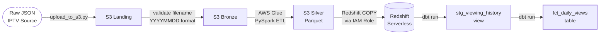
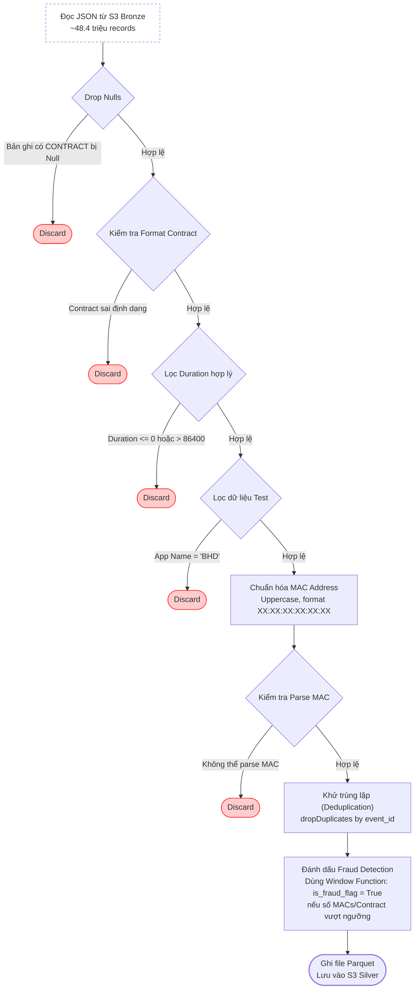

# Data Flow — IPTV Viewing History Pipeline

Khác với tài liệu [1.data-stack.md](./1.data-stack.md) (tập trung giải thích *lý do* lựa chọn công nghệ), tài liệu này nhằm trả lời cho câu hỏi: **"Dữ liệu di chuyển qua các điểm trung chuyển nào, được biến đổi ra sao, định dạng (format) và số lượng bản ghi (record) tương ứng tại mỗi bước là gì?"**.

---

## Phần 1 — Tổng quan Pipeline



Data pipeline được vận hành theo chu kỳ hàng ngày (**daily batch**), thông qua hệ thống điều phối tác vụ (orchestration) Apache Airflow, bao gồm 7 bước chạy theo trình tự:

| Tác vụ Airflow | Mô tả chi tiết | Thời gian thực thi |
| :--- | :--- | :--- |
| `check_and_prepare` | Xác thực sự tồn tại của file dữ liệu trên phân vùng Bronze theo `batch_date`. | \~1 giây |
| `trigger_glue_job` | Kích hoạt (submit) Glue job trên AWS. | \~1 giây |
| `wait_glue_complete` | Giám sát (poll) trạng thái thực thi của Glue job thông qua Sensor. | **\~2 phút** |
| `copy_to_redshift` | Thực thi lệnh `COPY` để tải dữ liệu từ S3 Silver vào Redshift Staging. | \~22 giây |
| `prepare_dbt_vars` | Thiết lập và truyền tham số `batch_date` vào hệ thống dbt. | \~1 giây |
| `run_dbt` | Thực thi `dbt run` để chuyển đổi dữ liệu qua các lớp `stg` và `fct`. | \~19 giây |
| `test_dbt` | Thực thi `dbt test` để kiểm tra chất lượng dữ liệu (`not_null`, `unique`). | \~13 giây |

> **Tổng thời gian vận hành hệ thống (end-to-end): \~3 phút 48 giây** *(Nguồn: Airflow Audit Log, 12/04/2026)*

-----

## Phần 2 — Cấu trúc lưu trữ (S3 Folder Structure)

Kiến trúc dữ liệu được tổ chức thành 3 phân lớp (layer) trên S3 bucket, áp dụng chiến lược phân vùng (partition) và định dạng lưu trữ đặc thù cho từng giai đoạn.

### 1. Phân vùng Bronze (Dữ liệu thô - JSON)

Dữ liệu đổ vào Bronze phải tuân thủ nghiêm ngặt định dạng tên file `YYYYMMDD.json`. Đây là điều kiện tiên quyết để task `check_and_prepare` xác nhận tính sẵn sàng của dữ liệu trước khi trigger Glue Job.

```text
bronze/
  year=2022/
    month=04/
      day=01/
        20220401.json
```

### 2. Phân vùng Silver (Dữ liệu sạch - Parquet)

Lớp Silver kế thừa cấu trúc phân vùng `year/month/day` từ lớp Bronze. Thiết kế này tối ưu hóa lệnh `COPY` của Redshift, cho phép hệ thống chỉ quét đúng thư mục chứa dữ liệu của ngày hiện tại (`batch_date`), loại bỏ hoàn toàn chi phí và độ trễ của việc quét toàn bộ bucket (full scan).

```text
silver/
  year=2022/
    month=04/
      day=01/
        part-00000.snappy.parquet
```

-----

## Phần 3 — Quá trình biến đổi Lược đồ (Schema Transformation)

Dưới đây là tóm tắt các điểm thay đổi cấu trúc dữ liệu khi di chuyển qua các lớp vật lý. *(Chi tiết đầy đủ xem tại [Từ điển dữ liệu](../data/2.dictionary.md))*

| Trường gốc (Landing) | Cấp Silver (PySpark) | Cấp Gold (`stg` view) | Thao tác biến đổi |
| :--- | :--- | :--- | :--- |
| `_id` | `event_id` | `event_id` | Đổi tên chuẩn hóa; sử dụng làm khóa chống trùng lặp (deduplication key). |
| `Contract` | `contract_id` | `contract_id` | Lọc bỏ các bản ghi có định dạng ID không hợp lệ. |
| `Mac` | `mac_address` | `device_mac` | Chuẩn hóa định dạng địa chỉ MAC thành chữ in hoa (`XX:XX:XX:XX:XX:XX`). |
| `TotalDuration` | `total_duration_seconds` | `total_duration_minutes` | Ép kiểu (cast) và chuyển đổi đơn vị đo lường từ giây sang phút tại lớp dbt. |
| *- Không có -* | `is_fraud_flag` | *- Không có -* | Cột đánh dấu rác/gian lận. Rows có `is_fraud_flag = true` bị loại tại `stg_viewing_history`; cột bị drop và không xuất hiện trong Gold layer. |
| *- Không có -* | *- Không có -* | `view_year/month/day` | Các cột thời gian phái sinh, được tách ra phục vụ việc partition và phân tích. |

-----

## Phần 4 — Luồng biến đổi dữ liệu (Glue Job Pipeline)

Module PySpark thực thi 8 bước xử lý tuần tự. Logic được thiết kế để **lọc dữ liệu rác (filter aggressively) từ sớm**, nhằm giảm thiểu số lượng bản ghi trước khi đưa vào các bước tính toán nặng (như Khử trùng lặp hoặc Window Function).



-----

## Phần 5 — Khảo sát truy vết dữ liệu (dbt Lineage)

Dữ liệu sau khi nạp vào Redshift sẽ đi qua hai module chính trong dbt:

```text
source: staging.viewing_history (Dữ liệu nạp từ lệnh COPY)
   └── view: stg_viewing_history (Lớp Staging)
           └── table: fct_daily_views (Lớp Data Mart)
```

**1. `stg_viewing_history` (View)**

  * Chuẩn hóa tên cột theo quy ước `snake_case`.
  * Ép kiểu biến đổi tham số `total_duration_seconds` thành `total_duration_minutes` (chia cho 60).
  * Phân rã tham số ngày tháng tạo các cột phái sinh: `view_year`, `view_month`, `view_day`.

**2. `fct_daily_views` (Table)**

  * Thực hiện gom nhóm (Aggregate) theo tổ hợp khóa `(batch_date, app_name)`.
  * Tính toán các chỉ số Business Metrics trọng yếu: Tổng số phiên (`total_sessions`), Lượng hợp đồng duy nhất (`unique_contracts`), Thiết bị duy nhất (`unique_devices`), Tổng giờ xem (`total_hours`), và Số phút xem trung bình mỗi phiên (`avg_minutes_per_session`).

-----

## Phần 6 — Tổng hợp biến chuyển Số lượng Bản ghi (Row Count)

*Các số liệu `[TODO]` hiện đang đợi được khớp với logs từ hệ thống AWS CloudWatch để cập nhật chính xác.*

| Giai đoạn chuyển đổi | Khối lượng Bản ghi | Số lượng bị loại | Lý do loại bỏ (Drop Logic) |
| :--- | :--- | :--- | :--- |
| **S3 Bronze (Raw)** | 48,457,499 | — | — |
| Drop Nulls | 48,457,493 | 6 | `CONTRACT IS NULL` |
| Filter Contract Format | 45,976,306 | 2,481,187 | Contract ID không đúng định dạng quy chuẩn |
| Filter Duration | `[TODO - verify từ Glue log]` | 72,410 | Thời lượng xem `<= 0` hoặc `> 86,400` giây (24h) |
| Filter Test App | `[TODO - verify từ Glue log]` | 1 | Dữ liệu phát sinh từ nội bộ (App = 'BHD') |
| Parse MAC Address | `[TODO - verify từ Glue log]` | 28 | Lỗi cấu trúc, không thể giải mã MAC address |
| Deduplication | `[TODO]` | `[TODO]` | Trùng lặp `event_id` |
| **S3 Silver (Cleaned)** | `[TODO]` | — | — |
| Redshift Staging | `[TODO]` | — | Nạp toàn bộ từ Silver (Full Load theo ngày) |
| **`fct_daily_views`** | `[TODO]` | — | Gom nhóm theo Ngày & Ứng dụng (\~8-10 records/ngày) |

>  **Tỉ lệ giữ lại (Retention Rate): `[TODO]%`**
> *(Được tính bằng số lượng bản ghi hợp lệ tại S3 Silver chia cho số lượng bản ghi gốc tại S3 Bronze).*