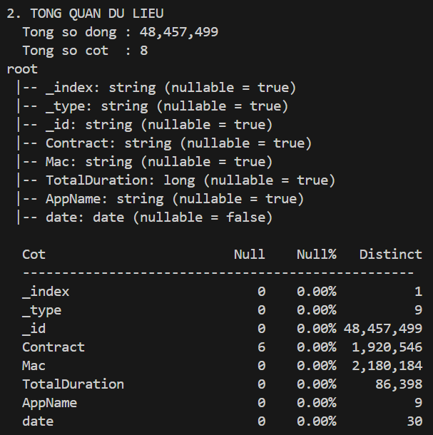
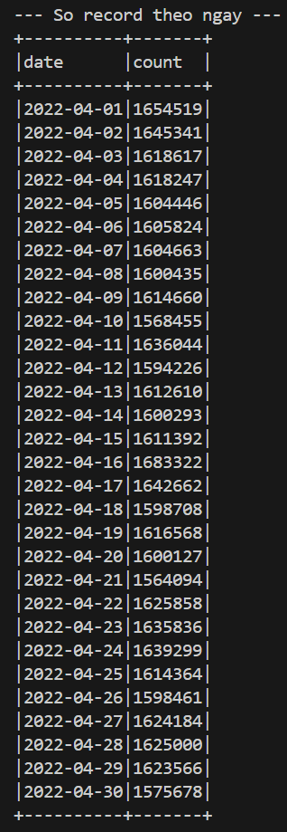
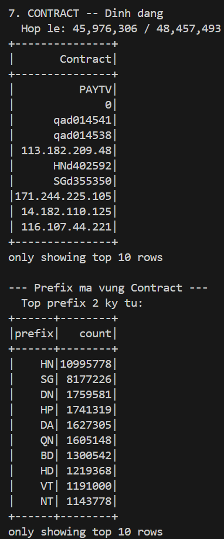
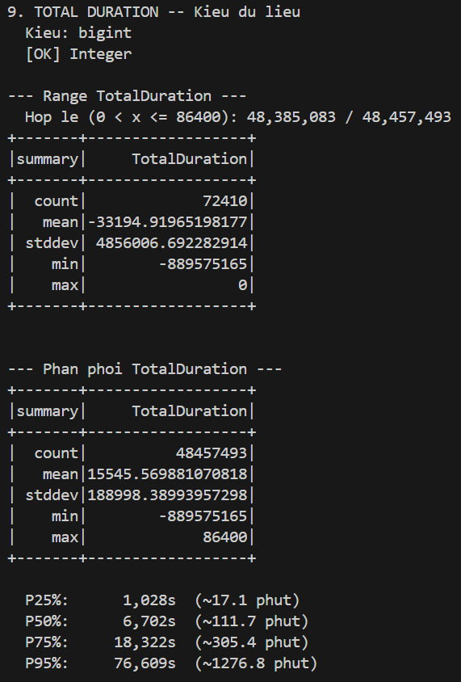
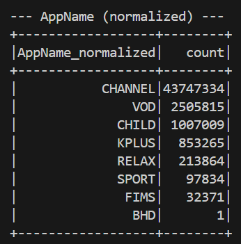

# Data Profiling Report — IPTV Viewing History

> **Phạm vi (Scope):** Landing Layer (raw JSON) — trước khi qua Glue ETL  
> **Công cụ (Tool):** PySpark 3.x — local mode (`local[32]`, 8 GB driver)  
> **Tập dữ liệu (Dataset):** 30 file JSON, `dataset/*.json`  
> **Thời gian (Period):** 2022-04-01 → 2022-04-30  
> **Thời gian chạy (Runtime):** 338.6 s  
> **Người phân tích (Analyst):** Phuc Vinh \
> **Cập nhật (Updated):** 12/04/2026

---

## 1. Tổng quan dữ liệu (Dataset Overview)

| Metric | Value |
|---|---|
| **Total rows (Landing)** | 48,457,499 |
| **Total columns** | 8 |
| **Date range** | 2022-04-01 → 2022-04-30 (30 ngày) |
| **Avg rows / day** | ~1,615,250 |
| **Min rows / day** | 1,564,094 (2022-04-21) |
| **Max rows / day** | 1,683,322 (2022-04-16) |
| **Day-over-day variance** | Thấp — ổn định trong khoảng ±5% |


Khối lượng dữ liệu (Volume) phân bố đều theo ngày, không có điểm đột biến (spike) bất thường. Ngày 21/04 (Thứ Năm) là ngày thấp nhất, ngày 16/04 (Thứ Bảy) là ngày cao nhất — tương quan với hành vi xem cuối tuần của người dùng IPTV.

### Schema (raw, sau khi flatten từ Elasticsearch export)

```
_index        string    — hằng số "history", luôn = 1 giá trị
_type         string    — tên app dạng lowercase (9 giá trị)
_id           string    — event ID, 20 ký tự alphanumeric
Contract      string    — mã hợp đồng thuê bao
Mac           string    — địa chỉ MAC thiết bị
TotalDuration long      — thời lượng xem (giây)
AppName       string    — tên app dạng uppercase (9 giá trị)
date          date      — parse từ tên file (pattern: yyyyMMdd)
```

---

## 2. Độ đầy đủ dữ liệu (Completeness & Null Analysis)

| Column | Null Count | Null % | Distinct Values | Ghi chú |
|---|---|---|---|---|
| `_index` | 0 | 0.00% | 1 | Hằng số `"history"` |
| `_type` | 0 | 0.00% | 9 | Lowercase của AppName |
| `_id` | 0 | 0.00% | 48,457,499 | Globally unique |
| `Contract` | **6** | 0.00% | 1,920,546 | Duy nhất có null |
| `Mac` | 0 | 0.00% | 2,180,184 | — |
| `TotalDuration` | 0 | 0.00% | 86,398 | Kiểu `bigint` |
| `AppName` | 0 | 0.00% | 9 | Uppercase của `_type` |
| `date` | 0 | 0.00% | 30 | Parse từ filename |

**Phát hiện chính (Findings):**

- Độ đầy đủ (Completeness) tổng thể **rất cao** — chỉ 6 dòng null ở `Contract` (0.0000124%), không đáng kể về volume nhưng cần drop để đảm bảo referential integrity ở Silver layer.
- `_index` là **hằng số** — không mang thông tin, có thể drop hoàn toàn.
- `_type` và `AppName` là **phản chiếu (mirror) 1-1** (lowercase ↔ uppercase) — giữ `AppName`, drop `_type` để tránh dư thừa (redundancy).
- `_id` có **48,457,499 distinct** = đúng bằng tổng số dòng (total rows) → **không có sự kiện trùng lặp (duplicate event)** ở nguồn (source).
- `date` được tổng hợp (synthetic) từ filename — không có trong raw JSON, cần giữ lại xuyên suốt pipeline.

**Hành động (Action) → Glue ETL:**
```
DROP columns: _index, _type
DROP rows WHERE Contract IS NULL
```

---

## 3. Event ID (`_id`)

| Metric | Value |
|---|---|
| Độ dài (Length) | 20 ký tự (uniform) |
| Tập ký tự (Character set) | `[A-Za-z0-9_\-]` — alphanumeric |
| Số lượng giá trị khác biệt (Distinct count) | 48,457,499 (= tổng số dòng) |
| Số lượng trùng lặp (Duplicate count) | **0** |

`_id` là event-level unique key đáng tin cậy. Có thể dùng trực tiếp làm **khóa loại bỏ trùng lặp (dedup key)** trong Glue job mà không cần composite key (khóa phức hợp).

---

## 4. Contract


### 4.1 Xác thực định dạng (Format Validation)

| Category | Count | % |
|---|---|---|
| Hợp lệ (regex `^[A-Z]{2,4}\d+$`) | 45,976,306 | **94.88%** |
| **Không hợp lệ** | **2,481,187** | **5.12%** |

Mẫu vi phạm phát hiện được:

| Giá trị | Vấn đề |
|---|---|
| `0` | Giá trị giữ chỗ/rác (Placeholder/garbage) — 357,047 MACs liên kết |
| `PAYTV` | Token tổng hợp (Aggregator token), không phải contract thực — 3,233 MACs |
| `NONFPT` | Tiền tố (Prefix) lạ — 2,024 records |
| `qad014541`, `HNd402592` | Chứa ký tự chữ thường (lowercase) |
| `113.182.209.48`, `171.244.225.105` | Địa chỉ IP (IP address) thay vì contract ID |

**Nguyên nhân gốc rễ (Root cause) suy luận:** Elasticsearch export không enforce schema — client SDK ghi sai trường hoặc backend fallback về IP khi chưa xác thực được contract.

### 4.2 Phân phối tiền tố địa lý (Geographic Prefix Distribution - 2 ký tự)

| Prefix | Vùng | Số records | % |
|---|---|---|---|
| `HN` | Hà Nội | 10,995,778 | 22.69% |
| `SG` | TP.HCM | 8,177,226 | 16.87% |
| `DN` | Đà Nẵng | 1,759,581 | 3.63% |
| `HP` | Hải Phòng | 1,741,319 | 3.59% |
| `DA` | Đắk Lắk / Đà Lạt | 1,627,305 | 3.36% |
| `QN` | Quảng Nam/Ninh | 1,605,148 | 3.31% |
| `BD` | Bình Dương | 1,300,542 | 2.68% |
| `HD` | Hải Dương | 1,219,368 | 2.52% |
| `VT` | Vũng Tàu | 1,191,000 | 2.46% |
| `NT` | Ninh Thuận | 1,143,778 | 2.36% |

HN + SG chiếm ~39.5% tổng lưu lượng (traffic) — phân bố địa lý hợp lý cho một nhà mạng IPTV quốc gia.

Tiền tố (Prefix) 3 ký tự (ví dụ `HNH`, `SGH`) có vẻ mã hóa (encode) thêm **loại gói/khu vực con** — cần xác nhận với nghiệp vụ (business).

### 4.3 Cardinality & Repeat Rate

| Metric | Value |
|---|---|
| Unique contracts | 1,920,546 |
| Total rows | 48,457,493 |
| Tỷ lệ đa dạng (Diversity ratio) | **0.0396** |
| Số session trung bình / contract | ~25.2 |

Mỗi contract xuất hiện trung bình **25 lần** trong 30 ngày — tương đương ~1 session/ngày, hợp lý với hành vi IPTV thực tế.

### 4.4 Mối quan hệ Contract ↔ MAC (Relationship)

| Metric | Value |
|---|---|
| Min MACs / contract | 1 |
| Max MACs / contract | **357,047** |
| Avg MACs / contract | **1.32** |
| Contracts có > 1 MAC | 210,456 (10.96%) |

**Bất thường (Anomalies) nghiêm trọng:**

| Contract | MAC count | Đánh giá |
|---|---|---|
| `0` | 357,047 | Giá trị rác (Garbage value) — toàn bộ thiết bị chưa ánh xạ (unmapped) dồn vào đây |
| `PAYTV` | 3,233 | Token tổng hợp (Aggregator token) |
| `HNFCN0001` | 635 | Dấu hiệu gian lận (Fraud candidate) — vượt xa ngưỡng bình thường |
| `HNH236275` | 479 | Dấu hiệu gian lận (Fraud candidate) |
| `SGFDN0463` | 289 | Dấu hiệu gian lận (Fraud candidate) |

**Ngưỡng phát hiện gian lận (Threshold fraud detection):** Avg + xấp xỉ 3σ → ngưỡng thực tế cần xác định với nghiệp vụ (business). Với avg=1.32 và phân bố đuôi dài (heavy-tail), nên dùng **ngưỡng dựa trên bách phân vị (percentile-based threshold)** (ví dụ: P99.9) thay vì mean ± σ.

---

## 5. MAC Address

### 5.1 Xác thực định dạng (Format Validation)

| Category | Count | % |
|---|---|---|
| Hợp lệ (12-hex hoặc colon-separated) | 48,457,465 | **~100%** |
| **Không hợp lệ** | **28** | 0.000058% |

Giá trị vi phạm duy nhất phát hiện: `001C55007900/40` — chứa ký tự `/` và số phần tử vượt 12 hex. Có thể là lỗi nối chuỗi (concatenation) ở client.

**Hành động (Action) → Glue ETL:** Normalize MAC về dạng chuẩn `XX:XX:XX:XX:XX:XX` (colon-separated, uppercase). Drop 28 dòng không parse được.

### 5.2 Mối quan hệ MAC ↔ Contract (Relationship)

| Metric | Value |
|---|---|
| Min contracts / MAC | 1 |
| Max contracts / MAC | **7** |
| Avg contracts / MAC | **1.16** |
| MACs xuất hiện với > 1 contract | 354,636 |

Một MAC liên kết tối đa 7 contracts là biên hợp lý — có thể do thiết bị gia đình dùng chung, đổi gói, hoặc thiết bị đầu thu được tái sử dụng. Không phải tín hiệu gian lận (fraud signal) riêng lẻ, nhưng cần kết hợp với chiều Contract→MAC để đánh dấu (flag).

---

## 6. TotalDuration

### 6.1 Kiểu dữ liệu (Data Type)

- Kiểu gốc: `bigint` ✓ — không cần cast.

### 6.2 Xác thực phạm vi (Range Validation)

| Category | Count | % |
|---|---|---|
| Hợp lệ (0 < x ≤ 86400) | **48,385,083** | **99.85%** |
| **Không hợp lệ** | **72,410** | **0.15%** |

Phân tích các giá trị **không hợp lệ**:

| Metric | Value |
|---|---|
| Count (invalid) | 72,410 |
| Mean (invalid) | −33,194 |
| Std Dev (invalid) | 4,856,006 |
| Min | **−889,575,165** |
| Max | 0 |

Toàn bộ 72,410 dòng không hợp lệ đều có `TotalDuration ≤ 0`:
- Giá trị `0` — session bắt đầu nhưng không ghi nhận thời lượng (rớt kết nối, sự kiện khởi động lạnh - connection drop, cold start event).
- Giá trị âm — **đây là bất thường (anomaly) nghiêm trọng**, khả năng cao do tràn bộ đệm thời gian (epoch timestamp overflow) hoặc client tính sai `(end_time - start_time)` khi đồng hồ thiết bị bị lệch (clock skew). Giá trị cực đoan `-889,575,165 s` ≈ `-28.2 năm` xác nhận đây là lỗi kỹ thuật, không phải dữ liệu thực.

**Hành động (Action) → Glue ETL:** `FILTER WHERE TotalDuration > 0 AND TotalDuration <= 86400`

### 6.3 Phân phối (Distribution - valid records)


| Percentile | Giây | Phút | Giờ |
|---|---|---|---|
| P25 | 1,028 s | ~17.1 min | — |
| P50 (median) | 6,702 s | ~111.7 min | ~1.9 h |
| P75 | 18,322 s | ~305.4 min | ~5.1 h |
| P95 | 76,609 s | ~1,276.8 min | ~21.3 h |
| Max | 86,400 s | 1,440 min | **24.0 h** |

| Metric | Value |
|---|---|
| Mean | 15,545 s (~259 min) |
| Std Dev | **188,998 s** |
| Hệ số biến thiên (CV) | ~12.16 |

**Insight chính:**

- **Median ~1.9h** — phù hợp với một buổi xem TV thông thường.
- **P95 ~21.3h** — top 5% người dùng (user) xem gần như cả ngày, hoặc để TV chạy nền liên tục.
- **Mean >> Median** (259 vs 112 phút) — phân phối **lệch phải (right-skewed) nặng**, bị kéo bởi những người dùng xem nhiều (heavy users) và các session để chạy nền qua đêm.
- **Std Dev 188,998s** với CV ~12 → cực kỳ không đồng nhất (heterogeneous), không nên dùng mean để đại diện; nên dùng median hoặc phân tích theo thập phân vị (decile) trong reporting.
- **Max = 86,400s (24h chính xác)** — đây là **giá trị trần (cap value)**, có thể do hệ thống nguồn (upstream system) giới hạn `TotalDuration` tại 86,400 để tránh tràn (overflow). Cần kiểm tra số dòng có giá trị đúng 86,400 nếu muốn phân tích heavy users chính xác hơn.

### 6.4 Độ ổn định trung bình theo ngày (Daily Average Stability)

```
Avg TotalDuration theo ngày: 14,293s – 16,143s
Biên dao động: ±1,850s so với mean tổng (~11.9%)
```

Không có đột biến (spike) bất thường. Ngày 2022-04-21 có avg thấp nhất (14,293s) trùng với ngày có khối lượng (volume) thấp nhất — có thể do sự kiện bên ngoài (sự cố mạng nhỏ, ngày lễ?) hoặc lỗi thu thập dữ liệu (data collection issue) cục bộ.

---

## 7. AppName


### 7.1 Phân phối (Distribution)

| AppName | Records | % |
|---|---|---|
| `CHANNEL` | 43,747,334 | **90.28%** |
| `VOD` | 2,505,815 | 5.17% |
| `CHILD` | 1,007,009 | 2.08% |
| `KPLUS` | 853,265 | 1.76% |
| `RELAX` | 213,864 | 0.44% |
| `SPORT` | 97,834 | 0.20% |
| `FIMS` | 32,371 | 0.07% |
| `BHD` | **1** | ~0.00% |

**Insight chính:**

- `CHANNEL` chiếm >90% — truyền hình trực tiếp (live TV) vẫn là nội dung chủ đạo của người dùng IPTV.
- `BHD` chỉ có **1 record duy nhất** — đây là **sự kiện kiểm thử (test event)** hoặc lỗi nhập dữ liệu (data entry); không đủ khối lượng (volume) để có ý nghĩa phân tích. **Loại bỏ trong Glue ETL** (đây là lý do của quy tắc nghiệp vụ/business rule `filter AppName != 'BHD'`).
- `_type` (lowercase) và `AppName` (uppercase) là **1-1 mapping hoàn toàn** → drop `_type`.

### 7.2 Insight theo App Segment

| Segment | Apps | % tổng |
|---|---|---|
| Linear TV | CHANNEL | 90.28% |
| On-Demand | VOD, FIMS, BHD | ~5.24% |
| Kids | CHILD | 2.08% |
| Premium/Sports | KPLUS, SPORT | 1.96% |
| Lifestyle | RELAX | 0.44% |

---

## 8. Vấn đề chất lượng dữ liệu (Data Quality Issues) — Tổng hợp & Glue Rules

| # | Issue | Severity | Volume | Glue Action |
|---|---|---|---|---|
| DQ-01 | Contract IS NULL | Low | 6 rows | `DROP` |
| DQ-02 | Định dạng (format) Contract không hợp lệ (IP, lowercase, placeholder) | High | ~2,481,187 (~5.1%) | `DROP` định dạng không hợp lệ |
| DQ-03 | Contract = `"0"` hoặc `"PAYTV"` | High | ~360K records | `DROP` (giá trị rác/garbage values) |
| DQ-04 | TotalDuration ≤ 0 (zero/negative) | High | 72,410 (0.15%) | `FILTER out` |
| DQ-05 | TotalDuration > 86400 | N/A | 0 | Rule dự phòng |
| DQ-06 | MAC format không hợp lệ (có `/` hoặc ký tự lạ) | Low | 28 rows | `DROP` |
| DQ-07 | AppName = `"BHD"` (test app, 1 record) | Low | 1 row | `DROP` |
| DQ-08 | `_index` hằng số | Info | 100% | `DROP column` |
| DQ-09 | `_type` = lowercase mirror của `AppName` | Info | 100% | `DROP column` |
| DQ-10 | Contract với quá nhiều MACs (≥ threshold) | Fraud | 210,456 contracts có >1 MAC | `FLAG` → `is_fraud_suspect` |
| DQ-11 | TotalDuration âm cực đoan (min = −889M) | Critical | Subset của DQ-04 | Loại bỏ qua DQ-04 |

### Ước tính số lượng dòng giữ lại (Estimated Row Retention)

```
Landing layer   : 48,457,499 rows (100%)
Sau drop null   : 48,457,493 rows (−6)
Sau filter duration valid : 48,385,083 rows (−72,410)
Sau filter AppName != BHD : 48,385,082 rows (−1)
Sau filter Contract valid  : ~45,900,000 rows (ước tính, −~2.5M)
──────────────────────────────────────────────
Silver layer (est.): ~45.9M rows (~94.7% retention)
```

---

## 9. Phát hiện gian lận và bất thường (Fraud & Anomaly Findings)

### 9.1 Multi-MAC Contracts (Contract → MAC)

| Contract | MAC count | Classification |
|---|---|---|
| `0` | 357,047 | **Rác hệ thống (System garbage)** — loại bỏ qua DQ-02/03 |
| `PAYTV` | 3,233 | **Rác hệ thống (System garbage)** — loại bỏ qua DQ-02/03 |
| `HNFCN0001` | 635 | **Nghi ngờ gian lận (Fraud suspect)** — vượt ngưỡng bất thường |
| `HNH236275` | 479 | **Nghi ngờ gian lận (Fraud suspect)** |
| `SGFDN0463` | 289 | **Nghi ngờ gian lận (Fraud suspect)** |

- 210,456 contracts (10.96%) có **ít nhất 2 MACs** — bình thường nếu hộ gia đình nhiều thiết bị.
- Avg = 1.32 MACs/contract, nhưng phần đuôi (tail) kéo rất dài → **ngưỡng (threshold) nên dùng P99 hoặc mức trần tuyệt đối (absolute cap)** (ví dụ ≥ 5 MACs) thay vì dựa trên trung bình (mean-based).
- Cờ theo dõi gian lận (Fraud flag) được implement trong Glue job dưới dạng cột `is_fraud_suspect` (boolean), **không drop** record — giữ lại để phân tích luồng dữ liệu sau (downstream) nếu cần.

### 9.2 Multi-Contract MACs (MAC → Contract)

- 354,636 MACs (16.3%) xuất hiện với **nhiều hơn 1 contract**.
- Max = 7 contracts / MAC — biên này hợp lý (thiết bị tái sử dụng, đổi gói).
- Không đánh dấu gian lận (flag fraud) ở tầng này — cần ngữ cảnh nghiệp vụ (business context) để quyết định.

---

## 10. Đề xuất (Recommendations) cho Pipeline

| # | Đề xuất (Recommendation) | Độ ưu tiên (Priority) |
|---|---|---|
| R-01 | Implement schema validation tại nguồn nạp (ingest: Landing → Bronze) thay vì chỉ ở Glue | Cao (High) |
| R-02 | Xác nhận với nghiệp vụ (business) về **ngưỡng gian lận (fraud threshold)** cho MACs/contract | Cao (High) |
| R-03 | Xác nhận tiền tố (prefix) 3–4 ký tự trong Contract có mã hóa (encode) vùng/gói không → dùng làm dimension | Trung bình (Medium) |
| R-04 | Giám sát (Monitor) daily avg TotalDuration — nếu giảm (drop) >15% so với mức cơ sở (baseline) thì cảnh báo (alert) pipeline | Trung bình (Medium) |
| R-05 | Kiểm tra đếm số bản ghi (count records) = 86,400 exact để đánh giá ảnh hưởng (impact) của giới hạn đầu nguồn (upstream cap) | Trung bình (Medium) |
| R-06 | Xem xét phân tích theo thập phân vị (decile) thay vì mean/avg cho `total_hours` trong mart layer | Thấp (Low) |
| R-07 | Ngày 2022-04-21 có khối lượng (volume) và avg_duration thấp nhất — điều tra nếu có thêm dữ liệu | Thấp (Low) |

## Phụ lục: Kết quả của src/dataprofiling.py

### 1. Tổng quan cấu trúc dữ liệu (Dataset Overview)


### 2. Phân bố khối lượng theo ngày (Daily Records Distribution)


### 3. Tổng quan theo tập Contract (Contract Overview)


### 4. Phân phối thời lượng xem (Duration Distribution)


### 5. Tỷ trọng dữ liệu theo Ứng dụng (AppName Distribution)
